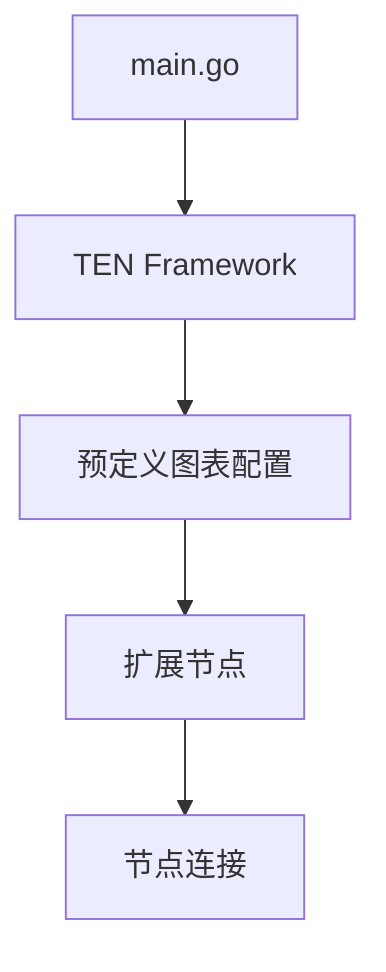
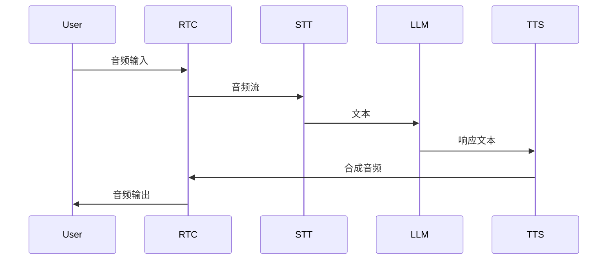

# Agents 文件夹架构分析

本文档分析了TEN-Agent项目中agents文件夹的架构设计和实现原理。

## 1. 核心架构

## 2. Golang主程序 (main.go)
- 作为框架的入口点
- 负责加载和初始化配置
- 管理应用生命周期
- 提供基础的日志功能

## 3. 预定义图表 (Predefined Graphs)

系统支持多种预配置的服务图表：

1. voice_assistant - 基础语音助手
2. voice_assistant_integrated_stt - 集成STT的语音助手
3. voice_assistant_realtime - 实时语音助手
4. story_teller - 故事讲述者
5. story_teller_stt_integrated - 集成STT的故事讲述者
6. story_teller_realtime - 实时故事讲述者

## 4. 扩展服务架构

### 4.1 核心服务组件

#### RTC服务 (agora_rtc)
- 处理实时音视频通信
- 支持音频流的发布和订阅
- 可选的集成ASR功能

#### 语音识别服务 (STT)
- deepgram_asr_python
- transcribe_asr_python
- 支持多种语音识别提供商

#### 语音合成服务 (TTS)
- fish_audio_tts
- azure_tts
- bytedance_tts
- elevenlabs_tts
- minimax_tts
- polly_tts

#### LLM服务
- openai_chatgpt_python
- openai_v2v_python
- gemini_llm_python
- qwen_llm_python

### 4.2 辅助服务
- interrupt_detector: 检测用户打断
- message_collector: 消息收集和管理
- weatherapi_tool_python: 天气信息服务
- openai_image_generate_tool: 图像生成服务

## 5. 服务连接机制

每个预定义图表包含：

### 5.1 节点定义
- type: 节点类型
- name: 节点名称
- addon: 使用的扩展
- property: 配置参数

### 5.2 连接定义
- 命令流：处理控制信号
- 数据流：处理业务数据
- 音频流：处理音频数据

## 6. Python扩展包特点

- 位于 `agents/ten_packages/extension/`
- 每个扩展都是独立的Python包
- 可以独立测试和部署
- 支持热插拔和动态加载

## 7. 独立测试能力

### 7.1 STT服务测试
可以独立测试，不依赖Agora RTC：
- 直接提供音频文件输入
- 配置相应的API密钥
- 验证文本输出

### 7.2 TTS服务测试
同样支持独立测试：
- 提供文本输入
- 配置服务密钥
- 验证音频输出

## 8. 总结

这种模块化的设计确保了各个服务组件可以独立开发、测试和部署，同时又能通过预定义图表灵活组合，构建不同的应用场景。系统的可扩展性和灵活性使其能够适应各种不同的使用场景和需求。
