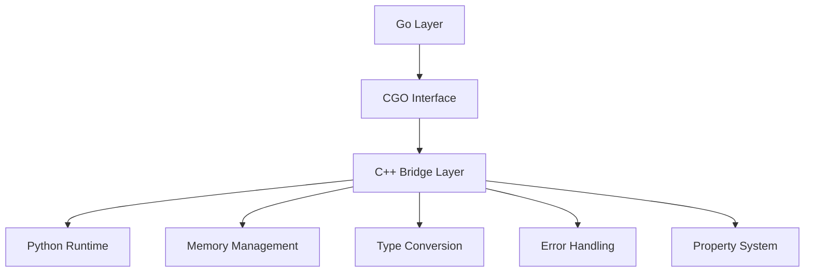

# C++ 桥接层分析

本文档分析了TEN Framework中C++层的实现，它作为Go和Python之间的桥接层，提供了关键的跨语言通信功能。

## 1. 核心功能



## 2. 关键组件

### 2.1 运行时环境管理
位置：`agents/ten_packages/system/ten_runtime_go/interface/ten/ten_env.h`

```cpp
typedef struct ten_go_ten_env_t ten_go_ten_env_t;

// 生命周期管理函数
void ten_go_ten_env_on_configure_done(uintptr_t bridge_addr);
void ten_go_ten_env_on_init_done(uintptr_t bridge_addr);
void ten_go_ten_env_on_deinit_done(uintptr_t bridge_addr);
```

### 2.2 属性系统
C++层实现了完整的属性访问和类型转换系统：

```cpp
// 属性获取和设置
ten_go_error_t ten_go_ten_env_get_property_type_and_size();
ten_go_error_t ten_go_ten_env_get_property_int32();
ten_go_error_t ten_go_ten_env_get_property_string();
ten_go_error_t ten_go_ten_env_set_property_json_bytes();
```

## 3. 主要功能实现

### 3.1 类型系统
C++层负责处理多种数据类型的转换：

1. **基础类型转换**
   - 整数类型 (int8 到 int64)
   - 浮点类型 (float32, float64)
   - 布尔类型
   - 字符串类型

2. **复杂类型转换**
   - JSON数据
   - 二进制数据
   - 指针和句柄

### 3.2 内存管理
- 管理跨语言对象的生命周期
- 处理Go和Python对象的引用计数
- 确保资源的正确释放
- 防止内存泄漏

### 3.3 错误处理机制
```cpp
typedef struct {
    int32_t code;
    const char* message;
} ten_go_error_t;
```

- 统一的错误码系统
- 跨语言异常转换
- 错误信息传递
- 资源清理保证

### 3.4 数据传输
1. **命令传输**
```cpp
ten_go_error_t ten_go_ten_env_send_cmd(
    uintptr_t bridge_addr,
    uintptr_t cmd_bridge_addr,
    ten_go_handle_t handler_id,
    bool is_ex
);
```

2. **数据流处理**
```cpp
ten_go_error_t ten_go_ten_env_send_data();
ten_go_error_t ten_go_ten_env_send_audio_frame();
ten_go_error_t ten_go_ten_env_send_video_frame();
```

## 4. 关键功能

### 4.1 Python扩展加载
C++层负责：
- 初始化Python解释器
- 加载Python模块
- 创建Python对象实例
- 管理Python对象生命周期

### 4.2 属性管理
提供了完整的属性访问系统：
- 类型检查和转换
- 值的获取和设置
- JSON数据处理
- 配置管理

### 4.3 通信桥接
实现了多种数据传输机制：
- 命令传输
- 数据流处理
- 音视频帧传输
- 事件通知

## 5. 技术特点

### 5.1 性能优化
- 最小化数据拷贝
- 高效的类型转换
- 内存池管理
- 引用计数优化

### 5.2 安全性保证
- 类型安全检查
- 内存边界检查
- 异常安全处理
- 资源泄漏防护

### 5.3 扩展性设计
- 模块化架构
- 标准化接口
- 插件式扩展
- 版本兼容性

## 6. 总结

C++桥接层在TEN Framework中扮演着关键角色，它：

1. 提供了Go和Python之间的高效通信机制
2. 实现了完整的类型系统和内存管理
3. 确保了跨语言调用的安全性和可靠性
4. 支持灵活的扩展机制

这种设计使得系统能够：
- 高效处理跨语言调用
- 安全管理内存和资源
- 支持复杂的数据类型转换
- 提供统一的错误处理机制
