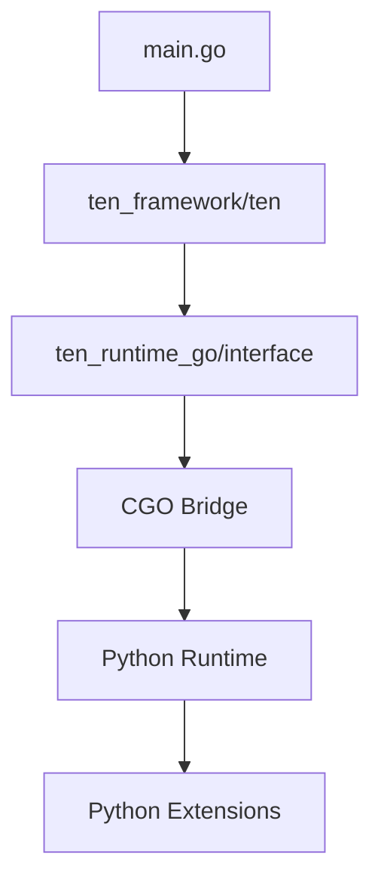

# Python扩展包加载机制分析

本文档分析了agents/main.go是如何加载和调用ten_packages中的Python扩展包的。

## 1. 核心架构



## 2. 关键代码位置

### 2.1 主程序入口
位置：`agents/main.go`
```go
import "ten_framework/ten"  // 通过go.mod映射到本地路径

func startAppBlocking(cfg *appConfig) {
    appInstance, err := ten.NewApp(&defaultApp{
        cfg: cfg,
    })
    if err != nil {
        log.Fatalf("Failed to create the app, %v\n", err)
    }

    appInstance.Run(true)
    appInstance.Wait()
}
```

### 2.2 框架映射
位置：`agents/go.mod`
```go
module app

go 1.20

// 关键映射：将ten_framework指向本地实现
replace ten_framework => ./ten_packages/system/ten_runtime_go/interface

require ten_framework v0.0.0-00010101000000-000000000000
```

### 2.3 运行时环境
位置：`agents/ten_packages/system/ten_runtime_go/interface/ten/ten_env.go`
```go
type TenEnv interface {
    OnConfigureDone() error
    OnInitDone() error
    OnCreateInstanceDone(instance any, context uintptr) error
    // ... 其他接口方法
}

func (p *tenEnv) OnConfigureDone() error {
    if p.attachToType == tenAttachToApp {
        // 在应用初始化时注册所有扩展
        if err := RegisterAllAddons(nil); err != nil {
            p.LogFatal("Failed to register all GO addons: " + err.Error())
            return nil
        }
    }
    // ...
}
```

## 3. 扩展包加载流程

### 3.1 启动流程
1. main.go通过go.mod将ten_framework映射到本地实现
2. 创建TEN应用实例(ten.NewApp)
3. 初始化运行时环境(TenEnv)
4. 加载配置文件(property.json)
5. 注册扩展包

### 3.2 扩展注册机制
1. Python扩展实现：
```python
@register_addon_as_extension("deepgram_asr_python")
class DeepgramASRExtensionAddon(Addon):
    def on_create_instance(self, ten: TenEnv, addon_name: str, context) -> None:
        from .extension import DeepgramASRExtension
        ten.on_create_instance_done(DeepgramASRExtension(addon_name), context)
```

2. Go侧注册处理：
```go
func (am *AddonManager) RegisterAddonAsExtension(
    addonName string,
    instance Addon,
) error {
    // 通过CGO桥接注册Python扩展
    registerHandler := func(registerCtx interface{}) error {
        // ... 扩展注册逻辑
    }
    am.registry[addonName] = registerHandler
    return nil
}
```

### 3.3 跨语言调用
1. Go -> C++ -> Python 调用链：
   - Go通过CGO调用C++层
   - C++层初始化Python解释器
   - 加载Python模块并创建实例

2. 数据流转：
   - 配置数据通过property.json传递
   - 运行时数据通过TenEnv接口传递
   - 错误信息通过统一的错误处理机制返回

## 4. 实际应用示例

以deepgram_asr_python为例：

```json
{
  "type": "extension",
  "name": "stt",
  "addon": "deepgram_asr_python",
  "extension_group": "stt",
  "property": {
    "api_key": "${env:DEEPGRAM_API_KEY}",
    "language": "en-US",
    "model": "nova-2"
  }
}
```

加载流程：
1. main.go读取配置
2. TEN框架初始化运行时
3. 通过CGO桥接加载Python模块
4. 创建扩展实例并注册
5. 运行时调用扩展功能

## 5. 关键技术点

### 5.1 框架设计
- 使用go.mod进行本地包映射
- 通过接口定义实现跨语言调用
- CGO提供语言间桥接能力

### 5.2 扩展机制
- Python装饰器实现扩展注册
- Go侧统一的扩展管理器
- 运行时动态加载和实例化

### 5.3 错误处理
- 跨语言异常转换
- 统一的日志记录机制
- 资源清理保证

## 6. 总结

agents/main.go通过精心设计的框架结构实现了对Python扩展包的加载和调用。关键在于：
1. 通过go.mod将框架映射到本地实现
2. 使用CGO提供跨语言能力
3. 统一的扩展管理机制
4. 标准化的接口定义

这种设计既保证了系统的可扩展性，又确保了跨语言调用的可靠性和性能。
