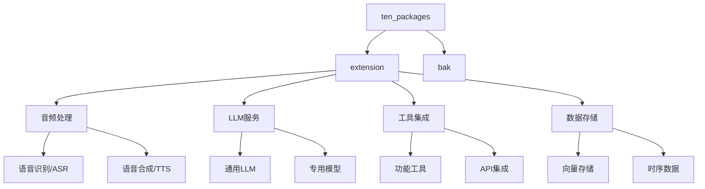

# TEN Packages 扩展包分析

本文档详细分析了agents/ten_packages目录下的扩展包架构和功能实现。

## 1. 扩展包总体架构



## 2. 功能模块分类

### 2.1 音频处理模块

#### 语音识别 (ASR)
- **deepgram_asr_python**
  - 使用Deepgram的ASR服务
  - 支持实时语音识别
  - 高准确度的转写能力

- **transcribe_asr_python**
  - 基于AWS Transcribe服务
  - 支持批量音频处理
  - 多语言支持

#### 语音合成 (TTS)
- **azure_tts**
  - 微软Azure的TTS服务
  - 自然的语音输出
  - 多种音色选择

- **bytedance_tts**
  - 字节跳动的语音合成服务
  - 中文优化支持

- **elevenlabs_tts**
  - 高质量的语音克隆
  - 情感语音合成

- **fish_audio_tts**
  - 轻量级TTS解决方案
  - 低延迟实时合成

- **minimax_tts**
  - 支持多语言
  - 自然语音合成

- **polly_tts**
  - AWS Polly服务集成
  - 多语言支持
  - 神经网络语音

### 2.2 LLM服务模块

#### 通用LLM集成
- **openai_chatgpt_python**
  - GPT模型集成
  - 对话上下文管理
  - 流式响应支持

- **gemini_llm_python**
  - Google Gemini模型集成
  - 多模态能力

- **qwen_llm_python**
  - 通义千问模型集成
  - 中文优化

#### 专用模型服务
- **openai_v2v_python**
  - 语音到语音转换
  - 实时处理能力

- **minimax_v2v_python**
  - 端到端语音转换
  - 低延迟处理

### 2.3 工具集成模块

#### 功能增强工具
- **interrupt_detector**
  - 用户打断检测
  - 实时响应处理

- **message_collector**
  - 消息收集和管理
  - 会话状态维护

#### API服务集成
- **weatherapi_tool_python**
  - 天气信息查询
  - 实时天气数据

- **bingsearch_tool_python**
  - 必应搜索集成
  - 信息检索能力

### 2.4 数据存储模块

- **aliyun_analyticdb_vector_storage**
  - 向量数据存储
  - 高效相似度搜索

- **tsdb_firestore**
  - 时序数据存储
  - 实时数据处理

## 3. 扩展包特性

### 3.1 通用特性
- 模块化设计
- 独立部署能力
- 标准化接口
- 配置驱动
- 错误处理机制

### 3.2 开发规范


### 3.3 配置管理
- 环境变量配置
- API密钥管理
- 服务参数设置
- 运行时配置

## 4. 集成方式

### 4.1 基础集成流程
1. 配置初始化
2. 服务连接
3. 功能调用
4. 资源释放

### 4.2 示例配置
```json
{
  "extension": "deepgram_asr_python",
  "property": {
    "api_key": "${env:DEEPGRAM_API_KEY}",
    "language": "en-US",
    "model": "nova-2"
  }
}
```

## 5. 最佳实践

### 5.1 选择建议
- 根据场景选择合适的ASR/TTS服务
- 考虑延迟要求选择对应实现
- 根据语言支持选择合适的模型
- 评估成本和性能平衡

### 5.2 性能优化
- 合理配置缓存
- 优化资源使用
- 控制并发请求
- 监控服务状态

## 6. 总结

TEN Packages提供了丰富的扩展能力，通过模块化设计和标准化接口，使得系统能够灵活地集成各种服务和功能。其完善的分类体系和配置管理机制，为开发者提供了强大而灵活的开发框架。
