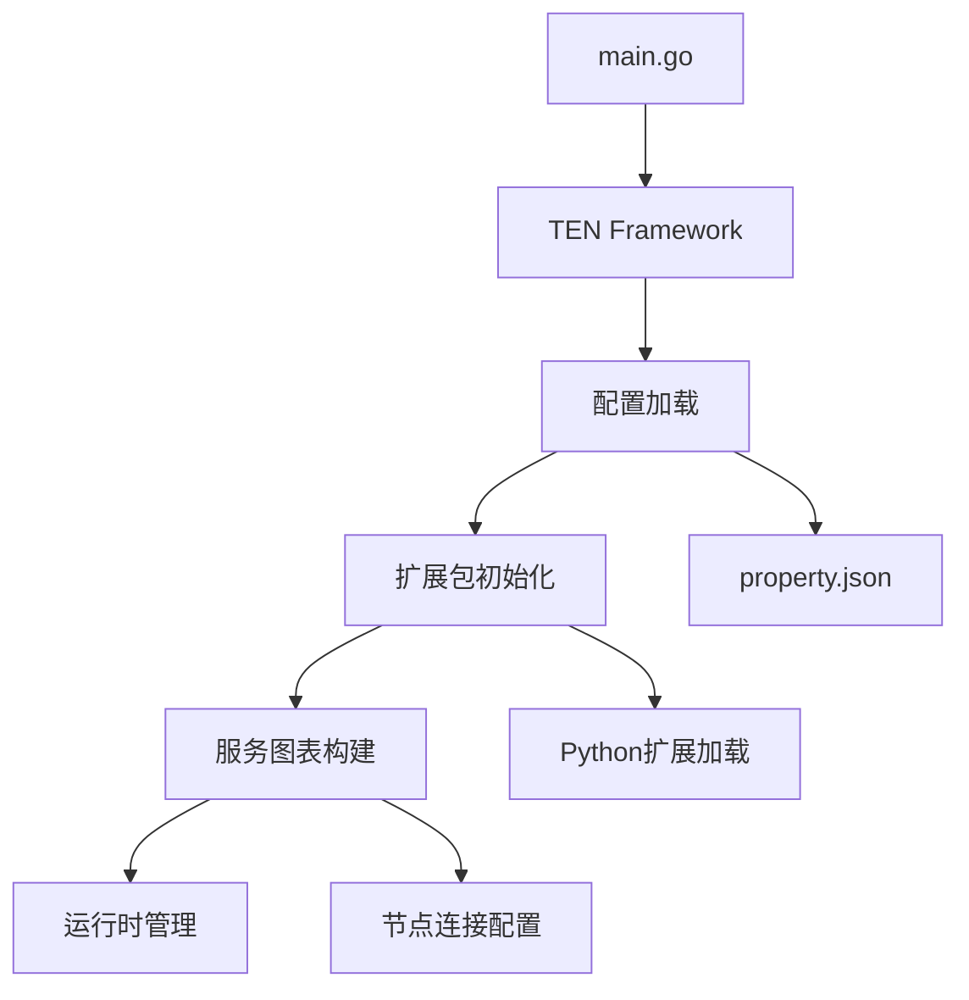
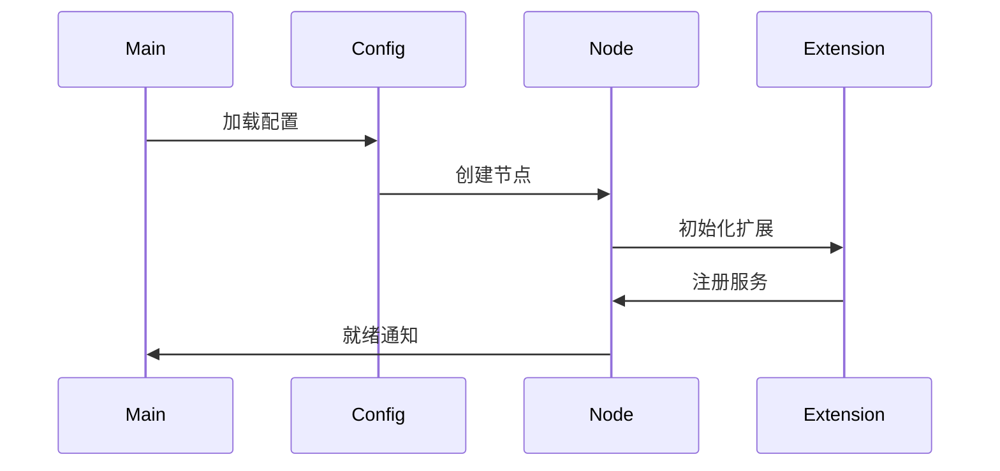
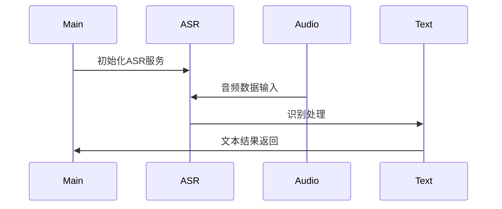
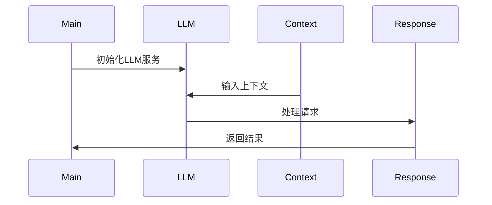

# TEN Packages 集成分析

本文档分析了agents主程序(main.go)是如何调用和集成ten_packages中的扩展包的。

## 1. 集成架构



## 2. 主程序启动流程

### 2.1 配置初始化
```go
func (p *defaultApp) OnConfigure(tenEnv ten.TenEnv) {
    if len(p.cfg.PropertyFilePath) > 0 {
        if b, err := os.ReadFile(p.cfg.PropertyFilePath); err != nil {
            log.Fatalf("Failed to read property file %s, err %v\n", p.cfg.PropertyFilePath, err)
        } else {
            tenEnv.InitPropertyFromJSONBytes(b)
        }
    }
    tenEnv.OnConfigureDone()
}
```

### 2.2 应用启动
```go
func startAppBlocking(cfg *appConfig) {
    appInstance, err := ten.NewApp(&defaultApp{
        cfg: cfg,
    })
    if err != nil {
        log.Fatalf("Failed to create the app, %v\n", err)
    }

    appInstance.Run(true)
    appInstance.Wait()
}
```

## 3. 服务图表构建

### 4.1 节点创建
- 根据配置创建服务节点
- 初始化节点属性
- 设置节点标识

### 4.2 节点连接


### 4.3 数据流配置
- 命令流：控制信号
- 数据流：业务数据
- 音频流：媒体数据

## 5. 运行时管理

### 5.1 生命周期管理
1. 初始化阶段
   - 加载配置
   - 创建实例
   - 连接服务

2. 运行阶段
   - 处理请求
   - 数据传输
   - 状态维护

3. 终止阶段
   - 停止服务
   - 资源释放
   - 连接断开

### 5.2 错误处理
- 配置错误处理
- 运行时异常处理
- 资源释放保证

## 6. 扩展包调用示例

### 6.1 语音识别服务调用


### 6.2 LLM服务调用


## 7. 最佳实践

### 7.1 配置管理
- 使用环境变量管理敏感信息
- 配置参数合理默认值
- 运行时配置校验

### 7.2 性能优化
- 合理配置并发
- 资源复用
- 连接池管理
- 错误重试策略

### 7.3 监控建议
- 服务状态监控
- 性能指标收集
- 错误日志记录
- 资源使用跟踪

## 8. 总结

TEN Packages通过灵活的配置系统和模块化的设计，实现了与主程序的无缝集成。这种设计不仅提供了强大的扩展能力，还确保了系统的可维护性和可靠性。通过预定义的服务图表和标准化的接口，开发者可以轻松地添加新的功能和服务。
