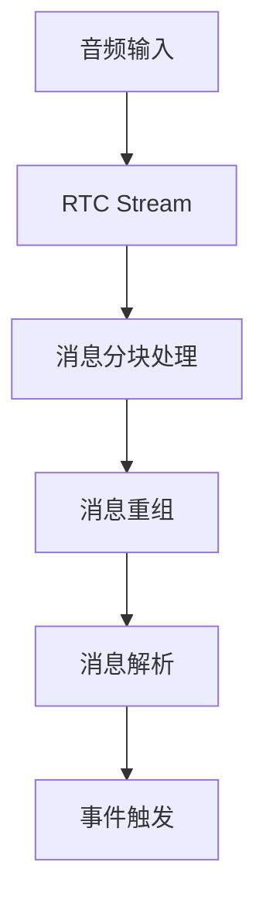
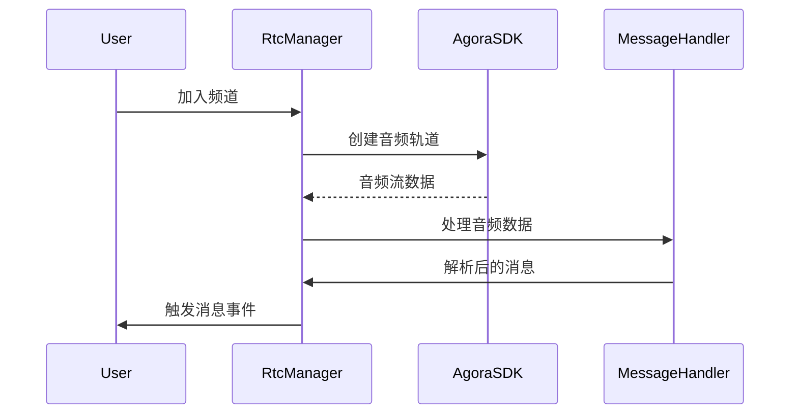

# Voice Assistant 工作原理分析

本文档分析了playground中voice-assistant的实现原理和工作流程。这是一个基于Agora RTC（Real-Time Communication）实现的语音助手系统。

## 核心组件

### 1. RTC通信核心 (RtcManager类)
- 使用Agora RTC SDK进行实时音视频通信
- 负责管理音视频流的发布和订阅
- 处理本地和远程用户的音视频轨道

### 2. 消息处理机制

### 3. 主要功能模块
- **音频轨道管理**：创建和管理麦克风音频轨道
- **视频轨道管理**：支持摄像头和屏幕共享
- **实时通信**：处理用户加入/离开、音视频发布/订阅等事件
- **消息处理**：支持文本、推理结果、图片等多种消息类型

### 4. 数据流转过程

## 系统特性

### 1. 消息类型支持
- TEXT: 普通文本消息
- REASON: 推理过程消息
- IMAGE: 图片类型消息

### 2. 事件系统
- 基于AGEventEmitter实现事件发布订阅机制
- 支持网络质量监控、远程用户变更、本地轨道变更等事件

### 3. 错误处理和超时机制
- 对不完整消息设置5秒超时处理
- 实现了完整的错误捕获和日志记录

## 技术实现细节

这个语音助手系统的设计非常模块化，通过事件驱动的方式处理各种实时通信场景，并且支持多种类型的消息交互。系统使用了分块传输和重组机制来处理大型消息，确保了通信的可靠性和实时性。

### 关键依赖
- Agora RTC SDK：提供核心的实时通信能力
- 需要正确配置appId和token才能正常工作

### 系统架构特点
- 组件职责划分清晰
- 良好的可维护性和扩展性
- 模块化设计
- 事件驱动架构
